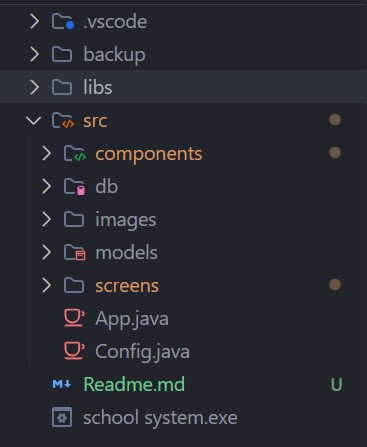

# 🏫 Java GUI School System 

The School Management System Project In Java is developed using Java Programming Language, This School Management System Project In Java And MySQL is simple with input validations rules, basic level small project for learning purposes. Also, you can modify this system as per your requirements and develop a perfect advance level project.

A School Management System Java Code allows you to keep the student records and manage them when needed. This is a simple java project with a good and interactive-looking GUI. This Project Use MySQL Database for managing all the data that store in the database.

---

## 📂 Folders Structure

 

- **📁 .vscode** 
    - contains `settings.json` file to register mysql connector in project.
- **📁 backup**
    - contains database `backup.sql` file
- **📁 libs**
    - contains `mysql-connector.jar` file
- **📁 src**
    - contains main project codebase
        - 📁 **components** 
            - contains custom GUI components
                - `BorderTextField.java`
                - `FadeButton.java`
                - `Label.java`
                - `MainMenu.java`
                - `RoundBorder.java`
        - 📁 **db** 
            - contains `DBConnection.java` file to open connection with database.
        - 📁 **images** 
            - project images like `logo.jpeg` & `logo.ico`.
        - 📁 **models** 
            - models is classes that represent database entities layer to handling database actions.
                - `Student.java`
                - `Teacher.java`
                - `User.java`                
        - 📁 **screens** 
            - contains project GUI screens that interact with user actions.
                - `AboutPage.java`
                - `AccountsFrame.java`
                - `BackupFrame.java`
                - `LoginFrame.java`
                - `MainFrame.java`
                - `StudentFrame.java`
                - `TeacherFrame.java`
                - `UserProfileUI.java`

    -  `App.java` is application entry point that start it.
    - `Config.java` contain image path of app logo.

-   `Readme.md` simple documentation of project.
- `school system.exe` is executable file of application

---
## 🎯 System contains many frames and parts 

- 🔐 Login 

- 📊 Dashboard with some statistics

- 👥 Users accounts with CRUD operations

- 👨🏼‍🎓 Students part with CRUD operations

- 👨🏼‍🏫 Teachers part with CRUD operations

- 📂 Backup and import backup page

- ⚡ Profile

- 📄 About system

---
## 👨🏼‍💻 Technologies and Tools

- Java swing package for GUI components.
- MySQL database to managing database.
- MySQL connector to connect java with MYSQL database.
- NetBeans IDE.
- VSCoduim text editor.
- Git and GitHub version control.

---

## 🥳 Team members

- Meshkat Galal 
- Khaled Abouobieda  
- Mohamed Anwer

Computer Sciences Students 